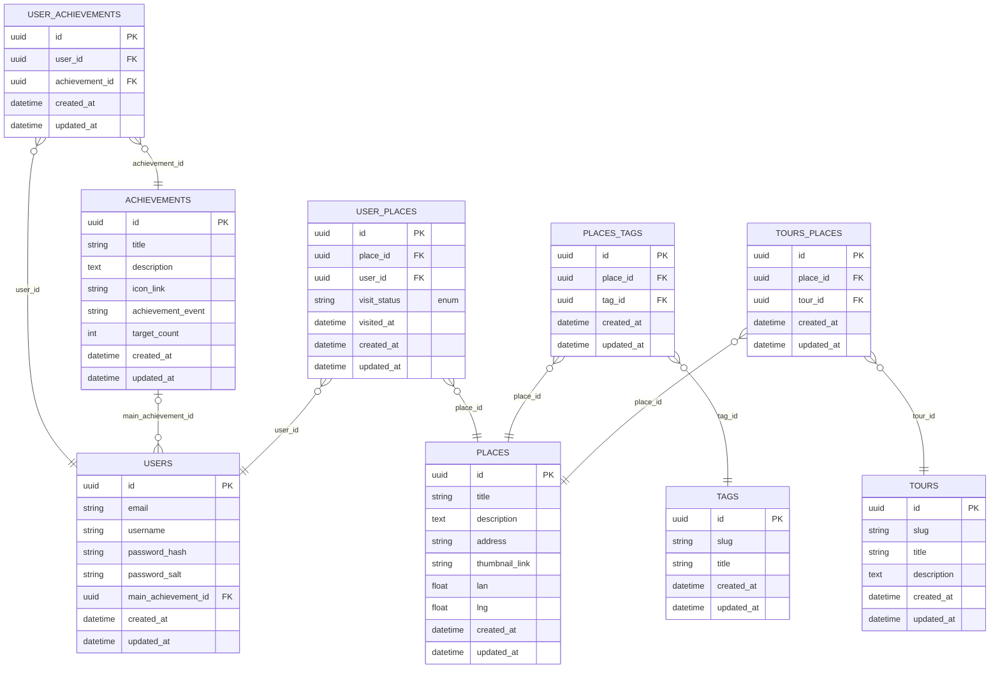

# KrokWalk 🗺️

Interactive Web Application for Personalized Self-Guided Tours

## ✨ Key Features

- **Interactive POI Selection**  
  Choose from a range of **tags** or **(thematic) tours**

- **Personalized Route Calculation**  
  Generates an optimal path based on:
  - Your selected preferences
  - Geolocation data
  - Time constraints

- **Interactive Map Interface**  
  Visualize your route and explore detailed info about each location.

- **User Progress & Gamification**  
  - Track your visit history  
  - Unlock achievements  
  - Confirm completed visits using geolocation
  *(Requires authentication)*

### ⚠️ What It Doesn't Do

While the app provides high-level route planning, it **does not** include:

- Turn-by-turn street-level navigation  
- Fine-grained routing between POIs  

Instead, it relies on external geospatial APIs for actual route traversal between locations  

Basic use cases:

## Features Preview

https://github.com/user-attachments/assets/1a4a7743-1b2c-4084-b066-495204e86da9

https://github.com/user-attachments/assets/3936abaa-fbe5-411e-8e77-00f797d52b51

## Technology stack

### Shared 👉   

### Server 👉    

### Client 👉    

## Architecture

## Basic Scenario of Self-Guided Tour Creation

## Database schema

## Prerequirements

- node `20.x.x`
- postgres / docker (create new postges db or use db from docker-compose)

## Installation Guide

1. copy values from .env.example to .env files for both backend and frontend
2. replace gereric values with correct one in both .env files
3. run `npm install` in root
4. run `npm run build -w shared`
5. run `npm run migrate:latest -w backend`
6. (optional) in order to seed places, run `npm run seed:run -w backend`
7. run `npm run dev -w backend`
8. run `npm run dev -w frontend`

## Troubleshooting

- Try running `npm install` directly in `apps/backend`
- Try running `npm install` directly in `apps/frontend`
- Ensure valid values in .env files
- Ensure correct connection string in backend .env
