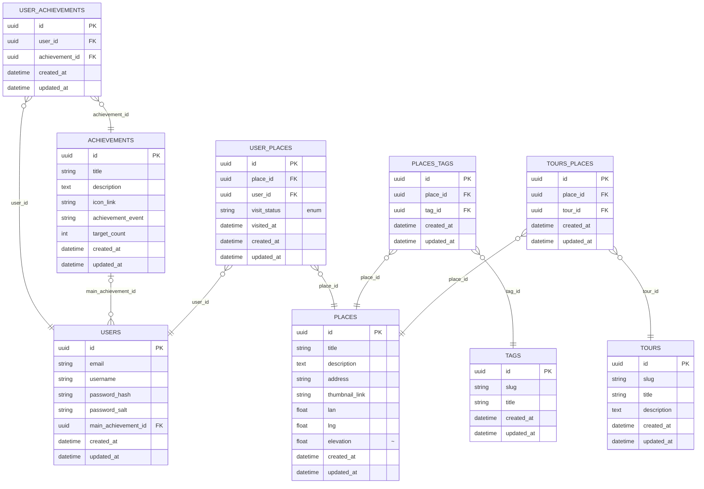

# KrokWalk

## database schema

```mermaid
erDiagram
    ACHIEVEMENTS {
        uuid id PK
        string title
        text description
        string icon_link
        string achievement_event
        int target_count
        datetime created_at
        datetime updated_at
    }


    %% UNIQUE(user_id, place_id)
    USER_ACHIEVEMENTS {
        uuid id PK
        uuid user_id FK
        uuid achievement_id FK
        datetime created_at
        datetime updated_at
    }
    USER_ACHIEVEMENTS }o--|| USERS : "user_id"
    USER_ACHIEVEMENTS }o--|| ACHIEVEMENTS : "achievement_id"

    USERS {
        uuid id PK
        string email
        string username
        string password_hash
        string password_salt
        uuid main_achievement_id FK
        datetime created_at
        datetime updated_at
    }
    ACHIEVEMENTS |o--o{ USERS : "main_achievement_id"

    PLACES {
        uuid id PK
        string title
        text description
        string address
        string thumbnail_link
        float lan
        float lng
        float elevation "~"
        datetime created_at
        datetime updated_at
    }

    TAGS {
        uuid id PK
        string slug
        string title
        datetime created_at
        datetime updated_at
    }

    TOURS {
        uuid id PK
        string slug
        string title
        text description
        datetime created_at
        datetime updated_at
    }

    %% UNIQUE(user_id, place_id)
    USER_PLACES {
        uuid id PK
        uuid place_id FK
        uuid user_id FK
        string visit_status "enum"
        datetime visited_at
        datetime created_at
        datetime updated_at
    }
    USER_PLACES }o--|| USERS : "user_id"
    USER_PLACES }o--|| PLACES : "place_id"


    PLACES_TAGS {
        uuid id PK
        uuid place_id FK
        uuid tag_id FK
        datetime created_at
        datetime updated_at
    }
    PLACES_TAGS }o--|| PLACES : "place_id"
    PLACES_TAGS }o--|| TAGS : "tag_id"

    TOURS_PLACES {
        uuid id PK
        uuid place_id FK
        uuid tour_id FK
        datetime created_at
        datetime updated_at
    }
    TOURS_PLACES }o--|| TOURS : "tour_id"
    TOURS_PLACES }o--|| PLACES : "place_id"
```
