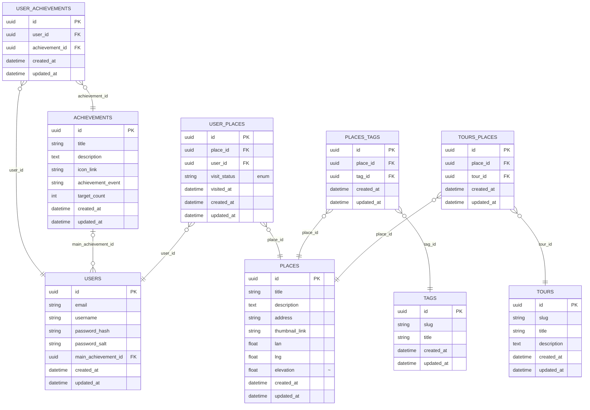

# KrokWalk

Interactive Web Application for Personalized Self-Guided Tours

## Prerequirements

- node `20.x.x`
- postgres / docker (create new postges db or use db from docker-compose)

## Installation Guide

1. copy values from .env.example to .env files for both backend and frontend
2. replace gereric values with correct one in both .env files
3. run `npm install` in root
4. run `npm run build -w shared`
5. run `npm run migrate:latest -w backend`
6. (optional) in order to seed places, run `npm run seed:run -w backend`
7. run `npm run dev -w backend`
8. run `npm run dev -w frontend`

## Troubleshooting

- Try running `npm install` directly in `apps/backend`
- Try running `npm install` directly in `apps/frontend`
- Ensure valid values in .env files
- Ensure correct connection string in backend .env

## Database schema

