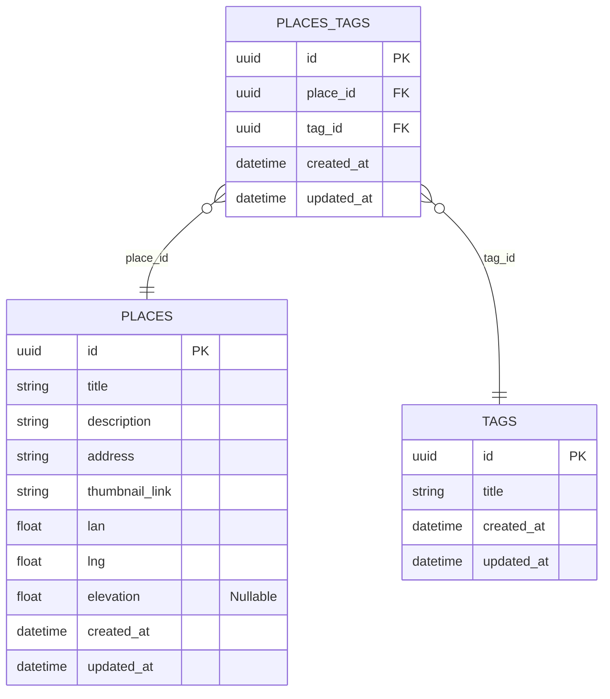

# KrokWalk

## database schema

```mermaid
erDiagram
    PLACES {
        uuid id PK
        string title
        string description
        string address
        string thumbnail_link
        float lan
        float lng
        float elevation "Nullable"
        datetime created_at
        datetime updated_at
    }

    PLACES_TAGS }o--|| PLACES : "place_id"
    PLACES_TAGS }o--|| TAGS : "tag_id"
    PLACES_TAGS {
        uuid id PK
        uuid place_id FK
        uuid tag_id FK
        datetime created_at
        datetime updated_at
    }

    TAGS {
        uuid id PK
        string title
        datetime created_at
        datetime updated_at
    }
```
